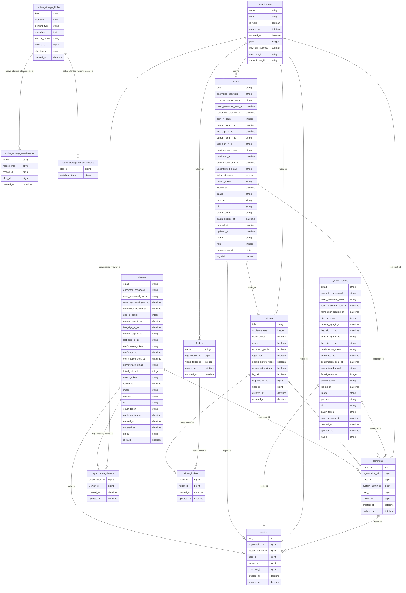

# ER Diagram

## ER図（スキーマから抽出）

```mermaid
 erDiagram
  active_storage_attachments {
    name string
    record_type string
    record_id bigint
    blob_id bigint
    created_at datetime
  }
  active_storage_blobs {
    key string
    filename string
    content_type string
    metadata text
    service_name string
    byte_size bigint
    checksum string
    created_at datetime
  }
  active_storage_variant_records {
    blob_id bigint
    variation_digest string
  }
  comments {
    comment text
    organization_id bigint
    video_id bigint
    system_admin_id bigint
    user_id bigint
    viewer_id bigint
    created_at datetime
    updated_at datetime
  }
  folders {
    name string
    organization_id bigint
    video_folder_id integer
    created_at datetime
    updated_at datetime
  }
  organization_viewers {
    organization_id bigint
    viewer_id bigint
    created_at datetime
    updated_at datetime
  }
  organizations {
    name string
    email string
    is_valid boolean
    created_at datetime
    updated_at datetime
    plan integer
    payment_success boolean
    customer_id string
    subscription_id string
  }
  replies {
    reply text
    organization_id bigint
    system_admin_id bigint
    user_id bigint
    viewer_id bigint
    comment_id bigint
    created_at datetime
    updated_at datetime
  }
  system_admins {
    email string
    encrypted_password string
    reset_password_token string
    reset_password_sent_at datetime
    remember_created_at datetime
    sign_in_count integer
    current_sign_in_at datetime
    last_sign_in_at datetime
    current_sign_in_ip string
    last_sign_in_ip string
    confirmation_token string
    confirmed_at datetime
    confirmation_sent_at datetime
    unconfirmed_email string
    failed_attempts integer
    unlock_token string
    locked_at datetime
    image string
    provider string
    uid string
    oauth_token string
    oauth_expires_at datetime
    created_at datetime
    updated_at datetime
    name string
  }
  users {
    email string
    encrypted_password string
    reset_password_token string
    reset_password_sent_at datetime
    remember_created_at datetime
    sign_in_count integer
    current_sign_in_at datetime
    last_sign_in_at datetime
    current_sign_in_ip string
    last_sign_in_ip string
    confirmation_token string
    confirmed_at datetime
    confirmation_sent_at datetime
    unconfirmed_email string
    failed_attempts integer
    unlock_token string
    locked_at datetime
    image string
    provider string
    uid string
    oauth_token string
    oauth_expires_at datetime
    created_at datetime
    updated_at datetime
    name string
    role integer
    organization_id bigint
    is_valid boolean
  }
  video_folders {
    video_id bigint
    folder_id bigint
    created_at datetime
    updated_at datetime
  }
  videos {
    title string
    audience_rate integer
    open_period datetime
    range boolean
    comment_public boolean
    login_set boolean
    popup_before_video boolean
    popup_after_video boolean
    is_valid boolean
    organization_id bigint
    user_id bigint
    created_at datetime
    updated_at datetime
  }
  viewers {
    email string
    encrypted_password string
    reset_password_token string
    reset_password_sent_at datetime
    remember_created_at datetime
    sign_in_count integer
    current_sign_in_at datetime
    last_sign_in_at datetime
    current_sign_in_ip string
    last_sign_in_ip string
    confirmation_token string
    confirmed_at datetime
    confirmation_sent_at datetime
    unconfirmed_email string
    failed_attempts integer
    unlock_token string
    locked_at datetime
    image string
    provider string
    uid string
    oauth_token string
    oauth_expires_at datetime
    created_at datetime
    updated_at datetime
    name string
    is_valid boolean
  }
  active_storage_blobs ||--o{ active_storage_attachments : "active_storage_attachment_id"
  active_storage_blobs ||--o{ active_storage_variant_records : "active_storage_variant_record_id"
  organizations ||--o{ comments : "comment_id"
  system_admins ||--o{ comments : "comment_id"
  users ||--o{ comments : "comment_id"
  videos ||--o{ comments : "comment_id"
  viewers ||--o{ comments : "comment_id"
  organizations ||--o{ folders : "folder_id"
  organizations ||--o{ organization_viewers : "organization_viewer_id"
  viewers ||--o{ organization_viewers : "organization_viewer_id"
  comments ||--o{ replies : "replie_id"
  organizations ||--o{ replies : "replie_id"
  system_admins ||--o{ replies : "replie_id"
  users ||--o{ replies : "replie_id"
  viewers ||--o{ replies : "replie_id"
  organizations ||--o{ users : "user_id"
  folders ||--o{ video_folders : "video_folder_id"
  videos ||--o{ video_folders : "video_folder_id"
  organizations ||--o{ videos : "video_id"
  users ||--o{ videos : "video_id"
```

