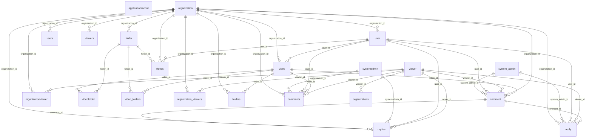

# ER Diagram from Models

## ER Diagram(主にリレーション)

```mermaid
erDiagram
  applicationrecord {
  }
  comment {
  }
  folder {
  }
  organization {
  }
  organizationviewer {
  }
  reply {
  }
  systemadmin {
  }
  user {
  }
  video {
  }
  videofolder {
  }
  viewer {
  }
  system_admin ||--o{ comment : "system_admin_id"
  user ||--o{ comment : "user_id"
  viewer ||--o{ comment : "viewer_id"
  organization ||--o{ comment : "organization_id"
  video ||--o{ comment : "video_id"
  comment ||--o{ replies : "comment_id"
  organization ||--o{ folder : "organization_id"
  folder ||--o{ video_folders : "folder_id"
  folder ||--o{ videos : "folder_id"
  organization ||--o{ users : "organization_id"
  organization ||--o{ organization_viewers : "organization_id"
  organization ||--o{ viewers : "organization_id"
  organization ||--o{ folders : "organization_id"
  organization ||--o{ videos : "organization_id"
  organization ||--o{ comments : "organization_id"
  organization ||--o{ replies : "organization_id"
  organization ||--o{ organizationviewer : "organization_id"
  viewer ||--o{ organizationviewer : "viewer_id"
  organization ||--o{ reply : "organization_id"
  system_admin ||--o{ reply : "system_admin_id"
  user ||--o{ reply : "user_id"
  viewer ||--o{ reply : "viewer_id"
  comment ||--o{ reply : "comment_id"
  systemadmin ||--o{ comments : "systemadmin_id"
  systemadmin ||--o{ replies : "systemadmin_id"
  organization ||--o{ user : "organization_id"
  user ||--o{ videos : "user_id"
  user ||--o{ comments : "user_id"
  user ||--o{ replies : "user_id"
  organization ||--o{ video : "organization_id"
  user ||--o{ video : "user_id"
  video ||--o{ comments : "video_id"
  video ||--o{ video_folders : "video_id"
  video ||--o{ folders : "video_id"
  video ||--o{ videofolder : "video_id"
  folder ||--o{ videofolder : "folder_id"
  viewer ||--o{ organization_viewers : "viewer_id"
  viewer ||--o{ organizations : "viewer_id"
  viewer ||--o{ comments : "viewer_id"
  viewer ||--o{ replies : "viewer_id"
```

