##### レコブルER図

```mermaid
erDiagram
  active_storage_attachments {
    text nihongoyaku "アクティブストレージ添付ファイルテーブル・説明用カラム。実際にはない"
    string name "名前・添付ファイルの名前"
    string record_type "レコードタイプ・関連レコードのタイプ（ポリモーフィック）"
    bigint record_id "レコードID・関連レコードの一意な識別子（ポリモーフィック）"
    bigint blob_id FK "Blob ID・関連Blobの一意な識別子"
    datetime created_at "作成日時・レコードの作成日時"
  }

  active_storage_blobs {
    text nihongoyaku "アクティブストレージBlobテーブル・説明用カラム。実際にはない"
    string key "キー・Blobのキー"
    string filename "ファイル名・Blobのファイル名"
    string content_type "コンテンツタイプ・Blobのコンテンツの種類"
    text metadata "メタデータ・Blobのメタデータ"
    string service_name "サービス名・サービスの名前"
    bigint byte_size "バイトサイズ・ファイルのサイズ"
    string checksum "チェックサム・ファイルのチェックサム"
    datetime created_at "作成日時・レコードの作成日時"
  }

  active_storage_variant_records {
    text nihongoyaku "アクティブストレージBlobテーブル・説明用カラム。実際にはない"
    bigint blob_id FK "Blob ID・関連Blobの一意な識別子"
    string variation_digest "バリエーションダイジェスト・バリエーションのハッシュ値"
  }

  comments {
    text nihongoyaku "コメントテーブル・説明用カラム。実際にはない"
    text comment "コメント内容"
    bigint organization_id FK "組織ID・関連組織の一意な識別子"
    bigint video_id FK "ビデオID・関連ビデオの一意な識別子"
    bigint system_admin_id FK "システム管理者ID・関連システム管理者の一意な識別子"
    bigint user_id FK "ユーザーID・関連ユーザーの一意な識別子"
    bigint viewer_id FK "視聴者ID・関連視聴者の一意な識別子"
    datetime created_at "作成日時・レコードの作成日時"
    datetime updated_at "更新日時・レコードの最終更新日時"
  }

  folders {
    text nihongoyaku "フォルダズテーブル・説明用カラム。実際にはない"
    string name "フォルダの名前"
    bigint organization_id FK "組織ID・関連組織の一意な識別子"
    integer video_folder_id FK "ビデオフォルダID・関連ビデオフォルダの一意な識別子"
    datetime created_at "作成日時・レコードの作成日時"
    datetime updated_at "更新日時・レコードの最終更新日時"
  }

  organization_viewers {
    text nihongoyaku "組織視聴者テーブル・説明用カラム。実際にはない"
    bigint organization_id FK "組織ID・関連組織の一意な識別子"
    bigint viewer_id FK "視聴者ID・関連視聴者の一意な識別子"
    datetime created_at "作成日時・レコードの作成日時"
    datetime updated_at "更新日時・レコードの最終更新日時"
  }

  organizations {
    text nihongoyaku "組織テーブル・説明用カラム。実際にはない"
    string name "組織の名前"
    string email "組織のメールアドレス"
    boolean is_valid "有効・組織が有効かどうか"
    datetime created_at "作成日時・レコードの作成日時"
    datetime updated_at "更新日時・レコードの最終更新日時"
  }

  replies {
    text nihongoyaku "返信テーブル・説明用カラム。実際にはない"
    text reply "返信内容"
    bigint organization_id FK "組織ID・関連組織の一意な識別子"
    bigint system_admin_id FK "システム管理者ID・関連システム管理者の一意な識別子"
    bigint user_id FK "ユーザーID・関連ユーザーの一意な識別子"
    bigint viewer_id FK "視聴者ID・関連視聴者の一意な識別子"
    bigint comment_id FK "コメントID・関連コメントの一意な識別子"
    datetime created_at "作成日時・レコードの作成日時"
    datetime updated_at "更新日時・レコードの最終更新日時"
  }

  system_admins {
    text nihongoyaku "システム管理者テーブル・説明用カラム。実際にはない"
    string email "システム管理者のメールアドレス"
    string encrypted_password "暗号化パスワード・システム管理者のパスワード"
    string reset_password_token "パスワードリセットのトークン"
    datetime reset_password_sent_at "リセットパスワード送信日時"
    datetime remember_created_at "リメンバー作成日時"
    integer sign_in_count "サインイン回数・サインインの回数"
    datetime current_sign_in_at "現在のサインイン日時・現在のサインインの日時"
    datetime last_sign_in_at "最後のサインイン日時・最後のサインインの日時"
    string current_sign_in_ip "現在のサインインIP・現在のサインインのIPアドレス"
    string last_sign_in_ip "最後のサインインIP・最後のサインインのIPアドレス"
    string confirmation_token "確認トークン・アカウント確認のトークン"
    datetime confirmed_at "確認日時・アカウント確認の日時"
    datetime confirmation_sent_at "確認送信日時・アカウント確認の送信日時"
    string unconfirmed_email "未確認メールアドレス・確認されていないメールアドレス"
    integer failed_attempts "失敗試行回数・失敗したサインインの回数"
    string unlock_token "アンロックトークン・アカウントロック解除のトークン"
    datetime locked_at "ロック日時・アカウントがロックされた日時"
    string image "システム管理者の画像"
    string provider "プロバイダー・OAuthプロバイダーの名前"
    string uid "OAuthプロバイダーのUID"
    string oauth_token "OAuthトークン・OAuthのトークン"
    datetime oauth_expires_at "OAuthトークン有効期限・OAuthトークンの有効期限"
    datetime created_at "作成日時・レコードの作成日時"
    datetime updated_at "更新日時・レコードの最終更新日時"
    string name "システム管理者の名前"
  }

  users {
    text nihongoyaku "ユーザーズテーブル・説明用カラム。実際にはない"
    string email "ユーザーのメールアドレス"
    string encrypted_password "暗号化パスワード・ユーザーのパスワード"
    string reset_password_token "パスワードリセットのトークン"
    datetime reset_password_sent_at "リセットパスワード送信日時"
    datetime remember_created_at "リメンバー作成日時"
    integer sign_in_count "サインイン回数・サインインの回数"
    datetime current_sign_in_at "現在のサインイン日時・現在のサインインの日時"
    datetime last_sign_in_at "最後のサインイン日時・最後のサインインの日時"
    string current_sign_in_ip "現在のサインインIP・現在のサインインのIPアドレス"
    string last_sign_in_ip "最後のサインインIP・最後のサインインのIPアドレス"
    string confirmation_token "確認トークン・アカウント確認のトークン"
    datetime confirmed_at "確認日時・アカウント確認の日時"
    datetime confirmation_sent_at "確認送信日時・アカウント確認の送信日時"
    string unconfirmed_email "未確認メールアドレス・確認されていないメールアドレス"
    integer failed_attempts "失敗試行回数・失敗したサインインの回数"
    string unlock_token "アンロックトークン・アカウントロック解除のトークン"
    datetime locked_at "ロック日時・アカウントがロックされた日時"
    string image "ユーザーの画像"
    string provider "プロバイダー・OAuthプロバイダーの名前"
    string uid "OAuthプロバイダーのUID"
    string oauth_token "OAuthトークン・OAuthのトークン"
    datetime oauth_expires_at "OAuthトークン有効期限・OAuthトークンの有効期限"
    datetime created_at "作成日時・レコードの作成日時"
    datetime updated_at "更新日時・レコードの最終更新日時"
    string name "ユーザーの名前"
    integer role "ユーザーの役割"
    bigint organization_id FK "組織ID・関連組織の一意な識別子"
    boolean is_valid "有効・ユーザーが有効かどうか"
  }

  video_folders {
    text nihongoyaku "ビデオフォルダズテーブル・説明用カラム。実際にはない"
    bigint video_id FK "ビデオID・関連ビデオの一意な識別子"
    bigint folder_id FK "フォルダID・関連フォルダの一意な識別子"
    datetime created_at "作成日時・レコードの作成日時"
    datetime updated_at "更新日時・レコードの最終更新日時"
  }

  videos {
    text nihongoyaku "ビデオズテーブル・説明用カラム。実際にはない"
    string title "ビデオのタイトル"
    integer audience_rate "観客評価・ビデオの観客評価"
    datetime open_period "公開期間・ビデオの公開期間"
    boolean range "範囲・ビデオの範囲"
    boolean comment_public "コメント公開・コメントが公開されるかどうか"
    boolean login_set "ログイン設定・ログインが必要かどうか"
    boolean popup_before_video "ビデオ前ポップアップ・ビデオの前にポップアップが表示されるかどうか"
    boolean popup_after_video "ビデオ後ポップアップ・ビデオの後にポップアップが表示されるかどうか"
    string data_url "データURL・ビデオのデータURL"
    boolean is_valid "有効・ビデオが有効かどうか"
    bigint organization_id FK "組織ID・関連組織の一意な識別子"
    bigint user_id FK "ユーザーID・関連ユーザーの一意な識別子"
    datetime created_at "作成日時・レコードの作成日時"
    datetime updated_at "更新日時・レコードの最終更新日時"
  }

  viewers {
    text nihongoyaku "視聴者テーブル・説明用カラム。実際にはない"
    string email "視聴者のメールアドレス"
    string encrypted_password "視聴者のパスワード"
    string reset_password_token "パスワードリセットのトークン"
    datetime reset_password_sent_at "リセットパスワード送信日時"
    datetime remember_created_at "リメンバー作成日時"
    integer sign_in_count "サインイン回数・サインインの回数"
    datetime current_sign_in_at "現在のサインイン日時・現在のサインインの日時"
    datetime last_sign_in_at "最後のサインイン日時・最後のサインインの日時"
    string current_sign_in_ip "現在のサインインIP・現在のサインインのIPアドレス"
    string last_sign_in_ip "最後のサインインIP・最後のサインインのIPアドレス"
    string confirmation_token "確認トークン・アカウント確認のトークン"
    datetime confirmed_at "確認日時・アカウント確認の日時"
    datetime confirmation_sent_at "確認送信日時・アカウント確認の送信日時"
    string unconfirmed_email "未確認メールアドレス・確認されていないメールアドレス"
    integer failed_attempts "失敗試行回数・失敗したサインインの回数"
    string unlock_token "アカウントロック解除のトークン"
    datetime locked_at "ロック日時・アカウントがロックされた日時"
    string image "視聴者の画像"
    string provider "OAuthプロバイダーの名前"
    string uid "OAuthプロバイダーのUID"
    string oauth_token "OAuthトークン・OAuthのトークン"
    datetime oauth_expires_at "OAuthトークン有効期限・OAuthトークンの有効期限"
    datetime created_at "作成日時・レコードの作成日時"
    datetime updated_at "更新日時・レコードの最終更新日時"
    string name "視聴者の名前"
    boolean is_valid "有効・視聴者が有効かどうか"
  }

  %% リレーション
  active_storage_attachments ||--o{ active_storage_blobs : "blob_id"
  active_storage_variant_records ||--o{ active_storage_blobs : "blob_id"
  comments ||--o{ organizations : "organization_id"
  comments ||--o{ system_admins : "system_admin_id"
  comments ||--o{ users : "user_id"
  comments ||--o{ videos : "video_id"
  comments ||--o{ viewers : "viewer_id"
  folders ||--o{ organizations : "organization_id"
  organization_viewers ||--o{ organizations : "organization_id"
  organization_viewers ||--o{ viewers : "viewer_id"
  replies ||--o{ comments : "comment_id"
  replies ||--o{ organizations : "organization_id"
  replies ||--o{ system_admins : "system_admin_id"
  replies ||--o{ users : "user_id"
  replies ||--o{ viewers : "viewer_id"
  users ||--o{ organizations : "organization_id"
  video_folders ||--o{ folders : "folder_id"
  video_folders ||--o{ videos : "video_id"
  videos ||--o{ organizations : "organization_id"
  videos ||--o{ users : "user_id"
```

##### Docs
##### 最新HotなER図を手元に置いておくために

##### ER図を含め、ドキュメントが開発に遅れることがないように。

##### 前提としてMarkdown Preview_Enhancedというvsコードの拡張機能を入れてください。

##### ER図自動生成コマンド↓

 docker-compose run --rm app node bin/generate_er_diagram.js

##### このコマンドにより、まず、Total_ER _Diagram.mdが生成されます。

##### 付随してエンティティのみを検出したTotal_E_Diagram.mdとリレーションのみを検知したTotal_R_Diagram.mdが生成されますが、あくまで、参考程度です。

##### このsaishin_ERD_v0.8.0.mdはjsで自動で検知されたER図を手動で手直ししたものです。バージョンと年月日も入れておき、いつの時点かわかるようにしておきました。

##### このER図は主に、テーブル名、カラム名、外部キーをスキーマから検出しました。

##### しかし、ポリモーフィックなどの複雑なリレーションはmodelsやactive_recordから検出する必要があり、当プロジェクトでは、まだポリモーフィックは少ししかありませんが将来的にはありうるかもしれません。(active_storage_attachmentsにポリモーフィックあり。)

##### 既存のgem 'rails-erd'         # グラフ形式でER図を生成するgem、、、はポリモーフィックがある場合では、循環リレーションの深度が深すぎて、エラーになり、検知できません。そこで、エンジニアの手元に、最新、ホットなER図を手元に置いておきたい、という趣旨から、jsでスクリプトを組みました。

##### マーメイドとマークダウンの組み合わせで、ER図とリレーションの一覧表を作成するようにしています。

##### 今回は、複雑なリレーションをjsで完璧に取り切ることは困難なので、基本的な大枠の構造を掴む一助にするスタンスでご活用下さい。

#####　この複雑なリレーションについては、一つ一つ手動で、追加する方法が逆に一番楽、と推察します。

##### ER図につき、カラム名の後に、非エンジニアでも大枠がわかるように、コメントを追加しておきました。

#####　このことにより、自分の実装を、この最新のER図を見ながら、ご説明いただければ、どの辺のことを、どう変えているのかが、一目瞭然化でき、コミュニケーションコストの大幅な削減、コミュニケーションのズレの早期発見に寄与すると信じます。それが、このツールの真価であり、エンジニアの開発体験の大幅な向上を目指したチャレンジです。

##### また、他エンジニアが行った改修や新機能も、アプリ全体の中のどの部分にかかわることなのか、が掴みやすくなり、何を言っているのかわからなかった、何を言いたいのかわからなかった、という不要なストレスを大幅削減できます。これにより、エンジニアの開発体験を向上することができ、非エンジニア、エンジニア両者がwin-win、エンジニア同士win-winも、となれれば良いと思いますのでぜひ使ってみてください。フィードバックもください。(お手柔らかに)

##### メタデータカラムとしてtext nihongoyakuを使用する理由と注意事項
背景と目的
本プロジェクトでは、ER図におけるテーブルの説明を日本語で提供するために、説明用カラムとしてtext nihongoyakuを使用しています。このカラムは、実際のデータベースには存在せず、説明目的のメタデータです。これにより、関係者がテーブルの役割や内容を直感的に理解できるようにしています。

##### text nihongoyakuの選定理由
実際に存在し得ないことの強調

descriptionなど一般的な名前を使うと、実際のデータベースに存在し得るため、text nihongoyakuを選定しました。これにより、説明用であることを一目で理解できます。
説明カラムとしての特殊性の明示

nihongoyakuという言葉自体が「日本語訳」を意味し、説明用カラムであることを強調しています。他の開発者が誤解することなく、説明用メタデータであることを認識できます。
コードとドキュメントの整合性

text nihongoyakuを使用することで、コードとドキュメントの整合性を保ち、データベース設計を理解しやすくします。実際のデータ構造に影響を与えないことが明確です。
使用上の注意

##### データベースには存在しないことの明示

text nihongoyakuは実際のデータベースには存在しません。あくまでER図上でのメタデータです。誤ってデータベーススキーマに含めないように注意してください。

##### 説明の一貫性

すべてのテーブルに対してtext nihongoyakuを使用し、テーブルの役割を一貫して説明してください。これにより、ER図全体の理解が統一され、開発者が構造を把握しやすくなります。

##### ER図生成ツールの対応

text nihongoyakuカラムはER図生成ツールで説明として扱われることを前提としています。ツールの仕様を確認した上で使用してください。

##### v0.8.0ではカラム名と、仕様書の完全なる一致までは到達していません。手動で地道に対応する予定です。

##### 建設的、積極的なご提案、ご貢献があれば、お願いしたいです。いつでも最新HotなER図！
