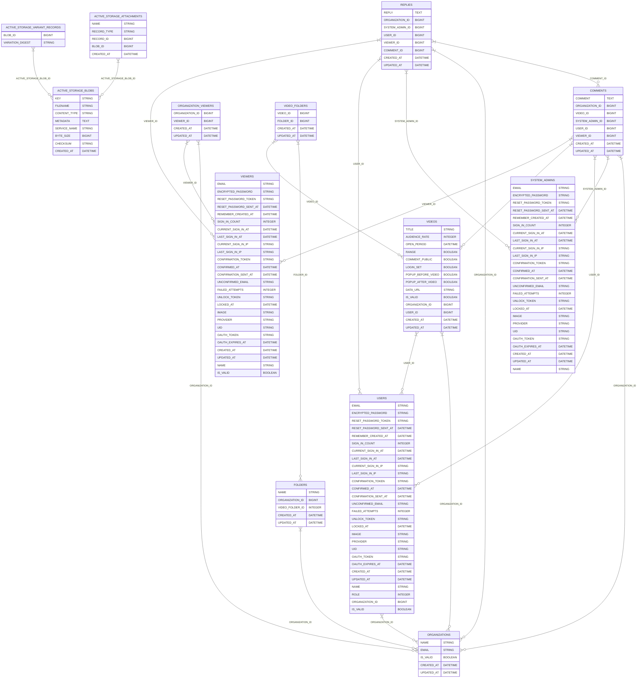

```mermaid
erDiagram
  ACTIVE_STORAGE_ATTACHMENTS {
    NAME STRING
    RECORD_TYPE STRING
    RECORD_ID BIGINT
    BLOB_ID BIGINT
    CREATED_AT DATETIME
  }
  ACTIVE_STORAGE_BLOBS {
    KEY STRING
    FILENAME STRING
    CONTENT_TYPE STRING
    METADATA TEXT
    SERVICE_NAME STRING
    BYTE_SIZE BIGINT
    CHECKSUM STRING
    CREATED_AT DATETIME
  }
  ACTIVE_STORAGE_VARIANT_RECORDS {
    BLOB_ID BIGINT
    VARIATION_DIGEST STRING
  }
  COMMENTS {
    COMMENT TEXT
    ORGANIZATION_ID BIGINT
    VIDEO_ID BIGINT
    SYSTEM_ADMIN_ID BIGINT
    USER_ID BIGINT
    VIEWER_ID BIGINT
    CREATED_AT DATETIME
    UPDATED_AT DATETIME
  }
  FOLDERS {
    NAME STRING
    ORGANIZATION_ID BIGINT
    VIDEO_FOLDER_ID INTEGER
    CREATED_AT DATETIME
    UPDATED_AT DATETIME
  }
  ORGANIZATION_VIEWERS {
    ORGANIZATION_ID BIGINT
    VIEWER_ID BIGINT
    CREATED_AT DATETIME
    UPDATED_AT DATETIME
  }
  ORGANIZATIONS {
    NAME STRING
    EMAIL STRING
    IS_VALID BOOLEAN
    CREATED_AT DATETIME
    UPDATED_AT DATETIME
  }
  REPLIES {
    REPLY TEXT
    ORGANIZATION_ID BIGINT
    SYSTEM_ADMIN_ID BIGINT
    USER_ID BIGINT
    VIEWER_ID BIGINT
    COMMENT_ID BIGINT
    CREATED_AT DATETIME
    UPDATED_AT DATETIME
  }
  SYSTEM_ADMINS {
    EMAIL STRING
    ENCRYPTED_PASSWORD STRING
    RESET_PASSWORD_TOKEN STRING
    RESET_PASSWORD_SENT_AT DATETIME
    REMEMBER_CREATED_AT DATETIME
    SIGN_IN_COUNT INTEGER
    CURRENT_SIGN_IN_AT DATETIME
    LAST_SIGN_IN_AT DATETIME
    CURRENT_SIGN_IN_IP STRING
    LAST_SIGN_IN_IP STRING
    CONFIRMATION_TOKEN STRING
    CONFIRMED_AT DATETIME
    CONFIRMATION_SENT_AT DATETIME
    UNCONFIRMED_EMAIL STRING
    FAILED_ATTEMPTS INTEGER
    UNLOCK_TOKEN STRING
    LOCKED_AT DATETIME
    IMAGE STRING
    PROVIDER STRING
    UID STRING
    OAUTH_TOKEN STRING
    OAUTH_EXPIRES_AT DATETIME
    CREATED_AT DATETIME
    UPDATED_AT DATETIME
    NAME STRING
  }
  USERS {
    EMAIL STRING
    ENCRYPTED_PASSWORD STRING
    RESET_PASSWORD_TOKEN STRING
    RESET_PASSWORD_SENT_AT DATETIME
    REMEMBER_CREATED_AT DATETIME
    SIGN_IN_COUNT INTEGER
    CURRENT_SIGN_IN_AT DATETIME
    LAST_SIGN_IN_AT DATETIME
    CURRENT_SIGN_IN_IP STRING
    LAST_SIGN_IN_IP STRING
    CONFIRMATION_TOKEN STRING
    CONFIRMED_AT DATETIME
    CONFIRMATION_SENT_AT DATETIME
    UNCONFIRMED_EMAIL STRING
    FAILED_ATTEMPTS INTEGER
    UNLOCK_TOKEN STRING
    LOCKED_AT DATETIME
    IMAGE STRING
    PROVIDER STRING
    UID STRING
    OAUTH_TOKEN STRING
    OAUTH_EXPIRES_AT DATETIME
    CREATED_AT DATETIME
    UPDATED_AT DATETIME
    NAME STRING
    ROLE INTEGER
    ORGANIZATION_ID BIGINT
    IS_VALID BOOLEAN
  }
  VIDEO_FOLDERS {
    VIDEO_ID BIGINT
    FOLDER_ID BIGINT
    CREATED_AT DATETIME
    UPDATED_AT DATETIME
  }
  VIDEOS {
    TITLE STRING
    AUDIENCE_RATE INTEGER
    OPEN_PERIOD DATETIME
    RANGE BOOLEAN
    COMMENT_PUBLIC BOOLEAN
    LOGIN_SET BOOLEAN
    POPUP_BEFORE_VIDEO BOOLEAN
    POPUP_AFTER_VIDEO BOOLEAN
    DATA_URL STRING
    IS_VALID BOOLEAN
    ORGANIZATION_ID BIGINT
    USER_ID BIGINT
    CREATED_AT DATETIME
    UPDATED_AT DATETIME
  }
  VIEWERS {
    EMAIL STRING
    ENCRYPTED_PASSWORD STRING
    RESET_PASSWORD_TOKEN STRING
    RESET_PASSWORD_SENT_AT DATETIME
    REMEMBER_CREATED_AT DATETIME
    SIGN_IN_COUNT INTEGER
    CURRENT_SIGN_IN_AT DATETIME
    LAST_SIGN_IN_AT DATETIME
    CURRENT_SIGN_IN_IP STRING
    LAST_SIGN_IN_IP STRING
    CONFIRMATION_TOKEN STRING
    CONFIRMED_AT DATETIME
    CONFIRMATION_SENT_AT DATETIME
    UNCONFIRMED_EMAIL STRING
    FAILED_ATTEMPTS INTEGER
    UNLOCK_TOKEN STRING
    LOCKED_AT DATETIME
    IMAGE STRING
    PROVIDER STRING
    UID STRING
    OAUTH_TOKEN STRING
    OAUTH_EXPIRES_AT DATETIME
    CREATED_AT DATETIME
    UPDATED_AT DATETIME
    NAME STRING
    IS_VALID BOOLEAN
  }
  ACTIVE_STORAGE_ATTACHMENTS }|--o{ ACTIVE_STORAGE_BLOBS : "ACTIVE_STORAGE_BLOB_ID"
  ACTIVE_STORAGE_VARIANT_RECORDS }|--o{ ACTIVE_STORAGE_BLOBS : "ACTIVE_STORAGE_BLOB_ID"
  COMMENTS }|--o{ ORGANIZATIONS : "ORGANIZATION_ID"
  COMMENTS }|--o{ SYSTEM_ADMINS : "SYSTEM_ADMIN_ID"
  COMMENTS }|--o{ USERS : "USER_ID"
  COMMENTS }|--o{ VIDEOS : "VIDEO_ID"
  COMMENTS }|--o{ VIEWERS : "VIEWER_ID"
  FOLDERS }|--o{ ORGANIZATIONS : "ORGANIZATION_ID"
  ORGANIZATION_VIEWERS }|--o{ ORGANIZATIONS : "ORGANIZATION_ID"
  ORGANIZATION_VIEWERS }|--o{ VIEWERS : "VIEWER_ID"
  REPLIES }|--o{ COMMENTS : "COMMENT_ID"
  REPLIES }|--o{ ORGANIZATIONS : "ORGANIZATION_ID"
  REPLIES }|--o{ SYSTEM_ADMINS : "SYSTEM_ADMIN_ID"
  REPLIES }|--o{ USERS : "USER_ID"
  REPLIES }|--o{ VIEWERS : "VIEWER_ID"
  USERS }|--o{ ORGANIZATIONS : "ORGANIZATION_ID"
  VIDEO_FOLDERS }|--o{ FOLDERS : "FOLDER_ID"
  VIDEO_FOLDERS }|--o{ VIDEOS : "VIDEO_ID"
  VIDEOS }|--o{ ORGANIZATIONS : "ORGANIZATION_ID"
  VIDEOS }|--o{ USERS : "USER_ID"
```
