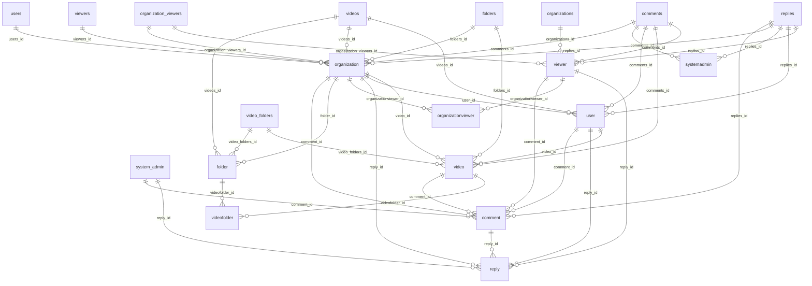

## 検出された各種要素
| テーブル名 | カラム数 | 主キー数 | 外部キー数 | belongs_to | has_many | has_one | has_and_belongs_to_many |
| ---------- | -------- | -------- | ---------- | ---------- | -------- | ------- | ---------------------- |
| active_storage_attachments | 5 | 0 | 0 | 0 | 0 | 0 | 0 |
| active_storage_blobs | 8 | 0 | 0 | 0 | 0 | 0 | 0 |
| active_storage_variant_records | 2 | 0 | 0 | 0 | 0 | 0 | 0 |
| comments | 8 | 0 | 0 | 0 | 0 | 0 | 0 |
| folders | 5 | 0 | 0 | 0 | 0 | 0 | 0 |
| organization_viewers | 4 | 0 | 0 | 0 | 0 | 0 | 0 |
| organizations | 5 | 0 | 0 | 0 | 0 | 0 | 0 |
| replies | 8 | 0 | 0 | 0 | 0 | 0 | 0 |
| system_admins | 25 | 0 | 0 | 0 | 0 | 0 | 0 |
| users | 28 | 0 | 0 | 0 | 0 | 0 | 0 |
| video_folders | 4 | 0 | 0 | 0 | 0 | 0 | 0 |
| videos | 14 | 0 | 0 | 0 | 0 | 0 | 0 |
| viewers | 26 | 0 | 0 | 0 | 0 | 0 | 0 |
